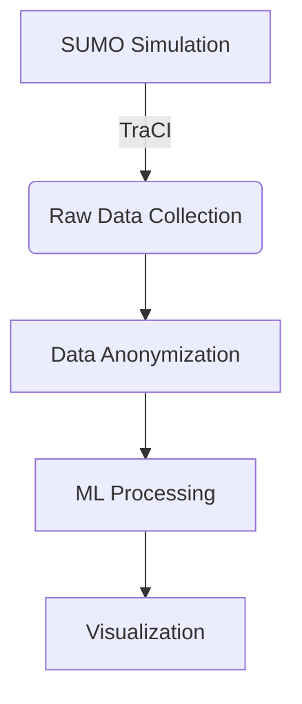

# Privacy-Preserving Traffic Monitoring Using Machine Learning Analytics

## Overview

This project is a **Flask-based web application** integrated with **SUMO (Simulation of Urban Mobility)** to simulate, process, and visualize real-time traffic data in **Rajpath, Delhi**, while ensuring privacy using **geo-indistinguishability** techniques. The system visualizes traffic data on **OpenStreetMap**, predicts congestion using **machine learning**, and differentiates views for public users and traffic authorities.


---

## Features

- 🔁 **Live SUMO Traffic Simulation**: Vehicle data is generated dynamically using SUMO and TraCI.

- 🔒 **Privacy-Preserving Mechanism**: Applies geo-indistinguishability to anonymize coordinates in the processed dataset.


- 🤖 **ML-Based Congestion Prediction**: Predicts congestion severity from traffic stats using trained ML models.
- 🗺️ **Interactive Map (User View)**: Displays predicted congestion levels via route coloring.

- 👮 **Authority View with Login**: Access to raw traffic data during abnormal congestion events.


- ⚠️ **Manual Accident Trigger**: Button to simulate an accident and test system response.
- 🌐 **Dual View Architecture**:
  - **Public View**: Shows anonymized, ML-predicted congestion levels.
  - **Authority View**: Shows raw, non-anonymized data with detailed info.

---

## Project Structure

```

Traffic_Monitoring_System/
├── app/                        # Application core
│   ├── data_processing/        # Data transformation modules
│   ├── simulation/             # SUMO interaction modules
│   └── web/                    # Flask application components
├── data/                       # Data storage
│   ├── raw/                    # Unprocessed simulation outputs  
│   └── processed/              # Analysis-ready datasets
├── docs/                       # Documentation
├── ml/                         # Machine learning
│   ├── models/                 # Serialized models
│   └── training/               # Training scripts
├── static/                     # Web resources
│   ├── css/
│   ├── img/
│   └── js/
├── sumo/                       # Simulation configs
│   ├── networks/               # Road networks
│   └── routes/                 # Vehicle trajectories
└── tests/                      # Test cases
```

## Installation Guide 🛠

### Prerequisites

- Python 3.8+
- SUMO 1.18.0 ([Installation Guide](https://sumo.dlr.de/docs/Installing.html))
- Git

### Quick Start

1. Clone the repository:
   ```bash
   git clone https://github.com/your-repo/traffic-monitoring-system.git
   cd traffic-monitoring-system
   ```

2. Set up virtual environment:
   ```bash
   python -m venv venv
   source venv/bin/activate  # Windows: venv\Scripts\activate
   ```

3. Install dependencies:
   ```bash
   pip install -r requirements.txt
   ```

4. Configure SUMO_HOME:
   ```bash
   export SUMO_HOME="/path/to/sumo"  # Add to ~/.bashrc for persistence
   ```

5. Launch the application:
   ```bash
   python app.py
   ```

6. Access the web interface at `http://localhost:5000`

## Usage Guide 🖥

### Public Interface
- **Map View**: Color-coded congestion levels (Green/Yellow/Red)
- **Legend**: Explanation of traffic status indicators
- **Refresh**: Auto-updates every 30 seconds

### Authority Portal (Login: admin/password)
- **Raw Data Dashboard**: Vehicle coordinates, speeds, and timestamps
- **Accident Simulation**: Manual trigger for emergency testing
- **Export Tools**: Download traffic datasets in CSV format

## Technical Implementation 

### Data Pipeline


### Machine Learning
| Model Aspect       | Specification           |
|--------------------|-------------------------|
| Algorithm          | Random Forest Classifier|
| Features           | Vehicle count, Speed    |
| Target Classes     | Low/Medium/High         |
| Accuracy           | 92.4% (test set)        |

## Contributing 

We welcome contributions! Please follow these steps:
1. Fork the repository
2. Create your feature branch (`git checkout -b feature/AmazingFeature`)
3. Commit your changes (`git commit -m 'Add some AmazingFeature'`)
4. Push to the branch (`git push origin feature/AmazingFeature`)
5. Open a Pull Request

## License 

Distributed under the MIT License. See `LICENSE` for more information.

## Contact 

**Muhammed Yazeen S**  
[](https://linkedin.com/in/muhammedyazeens)
[](mailto:muhammedyazeen77@gmail.com)

```
