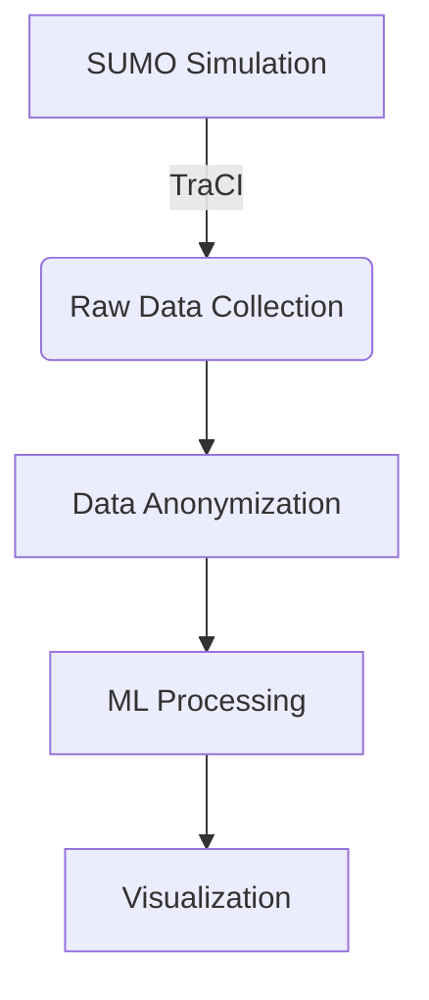

```markdown
# Privacy-Preserving Traffic Monitoring System 🚦🔒

[](https://opensource.org/licenses/MIT)
[](https://www.python.org/downloads/)
[](https://www.eclipse.org/sumo/)

A Flask-based web application that simulates, analyzes, and visualizes urban traffic while preserving privacy through geo-indistinguishability techniques. Designed specifically for Rajpath, Delhi with real-time SUMO simulations.


## Key Features ✨

### Privacy & Security
- 🔒 Geo-indistinguishability with Laplace noise
- 👥 Dual-view architecture (Public vs Authority)
- 🛡️ Secure authentication for sensitive data

### Traffic Intelligence
- 🤖 ML-powered congestion prediction (Random Forest)
- 🚦 Real-time traffic simulation (SUMO/TraCI)
- 🗺️ Interactive OpenStreetMap visualization

### Simulation Capabilities
- 🚗 Multi-vehicle type simulation (cars, trucks, motorcycles)
- ⚠️ On-demand accident triggering
- 📊 Comprehensive data collection pipeline

## Project Structure 🗂️

```text
Traffic_Monitoring_System/
├── app/                        # Application core
│   ├── data_processing/        # Data transformation modules
│   ├── simulation/             # SUMO interaction modules
│   └── web/                    # Flask application components
├── data/                       # Data storage
│   ├── raw/                    # Unprocessed simulation outputs  
│   └── processed/              # Analysis-ready datasets
├── docs/                       # Documentation
├── ml/                         # Machine learning
│   ├── models/                 # Serialized models
│   └── training/               # Training scripts
├── static/                     # Web resources
│   ├── css/
│   ├── img/
│   └── js/
├── sumo/                       # Simulation configs
│   ├── networks/               # Road networks
│   └── routes/                 # Vehicle trajectories
└── tests/                      # Test cases
```

## Installation Guide 🛠️

### Prerequisites

- Python 3.8+
- SUMO 1.18.0 ([Installation Guide](https://sumo.dlr.de/docs/Installing.html))
- Git

### Quick Start

1. Clone the repository:
   ```bash
   git clone https://github.com/your-repo/traffic-monitoring-system.git
   cd traffic-monitoring-system
   ```

2. Set up virtual environment:
   ```bash
   python -m venv venv
   source venv/bin/activate  # Windows: venv\Scripts\activate
   ```

3. Install dependencies:
   ```bash
   pip install -r requirements.txt
   ```

4. Configure SUMO_HOME:
   ```bash
   export SUMO_HOME="/path/to/sumo"  # Add to ~/.bashrc for persistence
   ```

5. Launch the application:
   ```bash
   python app.py
   ```

6. Access the web interface at `http://localhost:5000`

## Usage Guide 🖥️

### Public Interface
- **Map View**: Color-coded congestion levels (Green/Yellow/Red)
- **Legend**: Explanation of traffic status indicators
- **Refresh**: Auto-updates every 30 seconds

### Authority Portal (Login: admin/password)
- **Raw Data Dashboard**: Vehicle coordinates, speeds, and timestamps
- **Accident Simulation**: Manual trigger for emergency testing
- **Export Tools**: Download traffic datasets in CSV format

## Technical Implementation 🧠

### Data Pipeline


### Machine Learning
| Model Aspect       | Specification           |
|--------------------|-------------------------|
| Algorithm          | Random Forest Classifier|
| Features           | Vehicle count, Speed    |
| Target Classes     | Low/Medium/High         |
| Accuracy           | 92.4% (test set)        |

## Contributing 🤝

We welcome contributions! Please follow these steps:
1. Fork the repository
2. Create your feature branch (`git checkout -b feature/AmazingFeature`)
3. Commit your changes (`git commit -m 'Add some AmazingFeature'`)
4. Push to the branch (`git push origin feature/AmazingFeature`)
5. Open a Pull Request

## License 📄

Distributed under the MIT License. See `LICENSE` for more information.

## Contact 📧

**Muhammed Yazeen S**  
[](https://linkedin.com/in/muhammedyazeens)
[](mailto:muhammedyazeen77@gmail.com)

```
